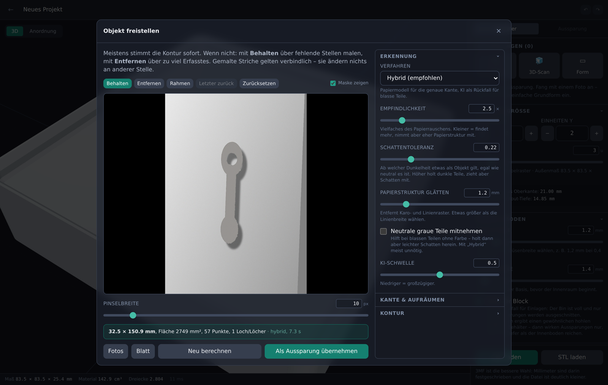

# Gridfinity Cutout Generator

Aus einem Foto wird ein druckfertiger Gridfinity-Einsatz mit passgenauer
Aussparung. Objekt auf ein DIN-A4-Blatt legen, abfotografieren, freistellen –
die App rechnet die Kontur in Millimeter um und schneidet sie als Tasche in
einen Gridfinity-Block. Optional lässt sich ein Objekt per Fotoserie in 3D
erfassen, sodass die Tasche der echten Form folgt statt nur dem Umriss.


## Was die Anwendung kann

- **Fotos sammeln, später verarbeiten.** Am Handy beliebig viele Fotos in einen
  Pool hochladen, am Rechner in Ruhe daraus Aussparungen machen. Jedes Foto
  behält Notiz, Status und die zuletzt benutzten Einstellungen.
- **Maß aus dem Foto.** Das Blatt im Bild dient als Referenz. Die vier Ecken
  werden automatisch erkannt und lassen sich nachziehen; daraus entsteht eine
  entzerrte Ansicht mit bekanntem Maßstab.
- **Objekt freistellen, schattenfest.** Das Papiermodell rechnet Schatten und
  ungleiches Licht heraus und kommt mit Karo- und Linienpapier zurecht; ein
  Erkennungsmodell springt bei blassen Teilen ein. Korrekturpinsel gelten
  verbindlich und wirken nur dort, wo gemalt wurde.
- **Mehrere Aussparungen je Bin**, frei verschiebbar und drehbar, mit
  Einrasten auf das 42-mm-Raster.
- **Viele Parameter:** Rastergröße, Höhe, Wand- und Bodenstärke, Stapelrand,
  Magnet- und Schraublöcher, Beschriftungssteg – und je Aussparung Tiefe,
  Spiel, Eckenradius, Entformschräge, Bodenradius, Durchbruch, Griffmulde und
  Fingerausschnitt.
- **Live-3D-Ansicht**, die Änderungen in etwa 100 ms nachzieht.
- **Autospeicherung** bei jeder Änderung, mit Rückgängig und Wiederholen.
- **Export als 3MF und STL**, wasserdicht und slicer-tauglich.
- **Optional: 3D-Aufnahme.** Objekt kopfüber auf ein gedrucktes Markerboard
  stellen, rundherum fotografieren – der Server rekonstruiert die Hüllform auf
  der CPU und stellt sie als Tasche bereit.

## Technik

| Bereich | Wahl | Begründung |
|---|---|---|
| Backend | Python 3.11, FastAPI, SQLite | Bildverarbeitung und Geometrie liegen in Python; SQLite spart einen weiteren Dienst |
| Geometrie | `manifold3d` + `trimesh` | robuste, schnelle CSG als reines pip-Wheel – kein OpenCASCADE nötig |
| Bildverarbeitung | OpenCV (headless) | Blatterkennung, Homographie, Freistellung |
| Freistellung | eigenes Papiermodell + U²-Net (ONNX) | siehe unten |
| 3D-Rekonstruktion | OpenCV ChArUco + eigenes Space Carving | läuft auf der CPU, ohne externe Binaries |
| Frontend | React, TypeScript, Vite, Tailwind | |
| 3D-Ansicht | three.js über react-three-fiber | |
| Hintergrundarbeit | Jobtabelle in SQLite + eigener Worker-Prozess | Rekonstruktionen dauern Minuten und gehören aus dem Request-Pfad heraus |

Dass die Geometrie **serverseitig** gerechnet wird und nicht im Browser, ist
Absicht: es gibt nur eine Quelle der Wahrheit für Vorschau und Export. Damit
sich das trotzdem flüssig anfühlt, wird der Bin-Rohkörper je Parametersatz
zwischengespeichert – beim Verschieben einer Tasche läuft nur noch der
Boolean. Zusätzlich trägt jede Vorschau ein ETag, sodass ein zurückgedrehter
Regler nichts kostet. Während des Ziehens zeigt der Client sofort einen
Umriss und holt das echte Netz verzögert nach.

---

## Installation

Zwei Wege, beide auf Debian 12/13 getestet. **Podman Compose** ist der
einfachere; die **native Installation** kommt ohne Container-Laufzeit aus und
passt gut in einen schlanken LXC.

### Was der Container braucht

Alle Zahlen sind an dieser Installation gemessen, nicht geschätzt.

**Plattenplatz für das Programm** (unter `/opt/gridfinity-cutout`):

| Variante | Größe |
|---|---|
| **alles an (Vorgabe)** | **800 MB** |
| ohne Erkennungsmodell (`WITH_AI=no`) | 560 MB |
| ohne 3D-Aufnahme (`WITH_SCAN=no`) | 582 MB |
| nur Grundfunktionen (beides aus) | 342 MB |
| kleines Modell (`AI_MODEL=u2netp`) | 637 MB |

Die Vorgabe setzt sich zusammen aus: 558 MB Python-Pakete, 67 MB
onnxruntime, 168 MB Erkennungsmodell und 2 MB eigener Code samt gebautem
Frontend. Das kleine Modell `u2netp` ist nur 4,4 MB groß und war im Test
fast gleich gut – wenn der Platz doch knapp wird, ist das die erste
Stellschraube.

**Systempakete:** rund 5 MB. Nur `python3-venv`, `curl`, `ca-certificates` und
`nginx`; auf einem üblichen Debian-Template ist davon das meiste schon da.
Bringt das Image kein Python mit, kommen etwa 67 MB dazu.

> Die sonst übliche Zeile `libgl1 libglib2.0-0 libgomp1` ist hier **nicht**
> nötig: Das headless-OpenCV-Wheel bringt ffmpeg, libpng und OpenBLAS selbst
> mit, NumPy und SciPy ihr eigenes libgomp. Das spart 242 MB. Ebenso wenig
> braucht es einen Compiler (`build-essential` samt Abhängigkeiten wären
> 457 MB) – alle Pakete liegen als fertige Wheels für amd64 und arm64 vor.

**Spitzenbedarf während der Installation.** Der Frontend-Build braucht
vorübergehend deutlich mehr, als am Ende belegt bleibt:

| | |
|---|---|
| Node.js + npm | ~140 MB |
| `node_modules` | 224 MB |
| npm-Cache (unter `/tmp`) | 52 MB |
| **zusammen, danach wieder frei** | **~415 MB** |

Das Skript räumt all das selbst wieder weg. Du brauchst den Platz also nur
während der Installation – aber du brauchst ihn. Wenn der nicht da ist:
Frontend auf einem anderen Rechner bauen (`npm install && npm run build`),
den Ordner `frontend/dist` mitkopieren und mit `SKIP_FRONTEND_BUILD=yes`
installieren. Node wird dann gar nicht erst eingerichtet.

**Nutzdaten** (unter `/var/lib/gridfinity-cutout`):

| | |
|---|---|
| Projekt mit einem Foto | 1–2,5 MB (Original + entzerrte Ansicht) |
| eine 3D-Aufnahme | 10–30 MB (24–40 Fotos à 0,4–0,75 MB) |
| rekonstruiertes Netz + Voxelgitter | 1–3 MB |
| Datenbank | wenige hundert kB |

Alte 3D-Aufnahmen lassen sich nach dem Übernehmen der Form löschen; das Netz
bleibt erhalten, die Einzelfotos verschwinden.

**Arbeitsspeicher**, als getrennte Prozesse gemessen:

| | |
|---|---|
| API, im Betrieb | 250–300 MB |
| API während einer Freistellung mit KI | +300–400 MB |
| Worker, untätig | ~100 MB |
| Worker, Spitze bei 40 Fotos à 2000 px | **339 MB** |

**Empfehlung**

| | Platte | RAM | Kerne |
|---|---|---|---|
| **alles an** | **3 GB** | 2 GB | 4+ |
| nur Fotos, ohne KI | 2 GB | 1 GB | 2 |
| sehr knapp (Frontend extern gebaut) | 1,5 GB | 1 GB | 2 |

Mit 6 GB bist du bequem versorgt, auch mit Platz für viele Projekte und
Sicherungen.

Die Plattenangaben enthalten das Debian-Grundsystem (je nach Template
0,3–0,5 GB), den Installationsspitzenwert und Luft für Projekte. Ein
unprivilegierter LXC genügt; besondere Rechte braucht die Anwendung nicht.

Zur Rechenzeit: Eine Rekonstruktion aus 40 Bildern dauerte auf 4 Kernen
18 Sekunden – allerdings mit synthetischen, kontrastreichen Aufnahmen. Mit
echten Fotos kosten Board-Erkennung und Freistellung deutlich mehr; auf einem
i5-13500 ist mit einigen Minuten zu rechnen.

### Weg A – Podman Compose (empfohlen)

```bash
apt update && apt install -y podman podman-compose git
git clone https://github.com/danieldidla/Gridfinity-Advancet-Cutout-Generator.git
cd Gridfinity-Advancet-Cutout-Generator

cp .env.example .env
# Schlüssel erzeugen und in die .env eintragen:
python3 -c "import secrets; print('GCG_SECRET_KEY=' + secrets.token_urlsafe(48))" >> .env

podman-compose up -d --build
```

Das Image enthält die 3D-Aufnahme. Ohne sie wird es rund 220 MB kleiner:

```bash
podman-compose build --build-arg WITH_SCAN=no && podman-compose up -d
```

Der erste Build dauert einige Minuten, weil das Frontend übersetzt wird.
Danach läuft die Anwendung auf **http://\<IP-des-Containers\>:8000**.

Mit Docker statt Podman funktioniert dieselbe Datei:

```bash
docker compose up -d --build
```

Als systemd-Dienst starten lassen:

```bash
podman generate systemd --new --files --name gridfinity-cutout-app
podman generate systemd --new --files --name gridfinity-cutout-worker
cp container-gridfinity-cutout-*.service /etc/systemd/system/
systemctl daemon-reload
systemctl enable --now container-gridfinity-cutout-app container-gridfinity-cutout-worker
```

Nützliche Befehle:

```bash
podman-compose logs -f app       # Protokoll der API
podman-compose logs -f worker    # Protokoll der Rekonstruktion
podman-compose down              # anhalten (Daten bleiben im Volume)
podman-compose up -d --build     # aktualisieren
```

### Weg B – Native Installation im LXC

```bash
apt update && apt install -y git
git clone https://github.com/danieldidla/Gridfinity-Advancet-Cutout-Generator.git
cd Gridfinity-Advancet-Cutout-Generator
sudo bash deploy/install.sh
```

Das installiert alles: 3D-Aufnahme und Erkennungsmodell inbegriffen. Wird der
Platz knapp, lässt sich beides einzeln abschalten:

```bash
sudo WITH_SCAN=no bash deploy/install.sh        # ohne 3D-Aufnahme   (−220 MB)
sudo WITH_AI=no   bash deploy/install.sh        # ohne Erkennungsmodell (−235 MB)
sudo AI_MODEL=u2netp bash deploy/install.sh     # kleines Modell     (−164 MB)
```

Beides lässt sich jederzeit nachholen. Fehlt etwas, sagt die Oberfläche das an
der Stelle, wo es gebraucht würde; alles andere arbeitet unberührt weiter.

Das Skript installiert die Systempakete, legt das Dienstkonto `gridfinity` an,
richtet unter `/opt/gridfinity-cutout` eine virtuelle Python-Umgebung ein, baut
das Frontend, schreibt zwei systemd-Units und stellt nginx davor. Am Ende
steht die Adresse im Terminal. Die Anwendung ist dann über **Port 80**
erreichbar.

Das Skript lässt sich gefahrlos erneut ausführen, um zu aktualisieren:

```bash
cd Gridfinity-Advancet-Cutout-Generator && sudo bash deploy/update.sh
```

Mehr dazu unter [Aktualisieren](#aktualisieren).

Alle Schalter des Installationsskripts:

| Variable | Vorgabe | Wirkung |
|---|---|---|
| `WITH_SCAN` | `yes` | 3D-Aufnahme (218 MB) |
| `WITH_AI` | `yes` | Erkennungsmodell für „KI“/„Hybrid“ (235 MB) |
| `AI_MODEL` | `u2net` | `u2netp` ist 4,4 statt 168 MB und fast gleich gut |
| `SLIM` | `no` | Test-Suites der Python-Pakete entfernen (−21/−63 MB) |
| `SKIP_FRONTEND_BUILD` | `no` | Fertiges `frontend/dist` übernehmen, kein Node |
| `KEEP_BUILD_DEPS` | `no` | `node_modules` und Node behalten (für Entwicklung) |
| `WITH_BUILD_TOOLS` | `no` | Compiler mitinstallieren (nur ohne fertige Wheels) |
| `INSTALL_NGINX` | `yes` | Reverse Proxy einrichten |
| `PORT` / `HTTP_PORT` | `8000` / `80` | Ports |
| `SERVER_NAME` | `_` | Servername für nginx |
| `APP_DIR` / `DATA_DIR` | `/opt/...` / `/var/lib/...` | Ablageorte |

Beispiel für eine knapp bemessene Maschine, Frontend extern gebaut:

```bash
sudo SKIP_FRONTEND_BUILD=yes SLIM=yes bash deploy/install.sh
```

Betrieb:

```bash
systemctl status gridfinity-cutout gridfinity-cutout-worker
journalctl -u gridfinity-cutout -f
nano /etc/gridfinity-cutout.env          # danach neu starten
systemctl restart gridfinity-cutout gridfinity-cutout-worker
```

Entfernen: `sudo bash deploy/uninstall.sh` (mit `--purge` samt Projektdaten).

### Nach der Installation

1. Seite aufrufen und ein Konto anlegen. **Das erste Konto wird automatisch
   Administrator.**
2. Danach in der Konfiguration `GCG_ALLOW_REGISTRATION=false` setzen und die
   Dienste neu starten, wenn sich sonst niemand registrieren können soll.
   Weitere Konten legt der Administrator dann unter *Verwaltung* an.

### HTTPS und die Kamera im Browser

Die Aufnahme direkt aus dem Browser (`getUserMedia`) geben Browser nur über
**HTTPS** oder auf `localhost` frei. Ohne TLS funktioniert alles andere
weiterhin – Fotos lassen sich hochladen, was vom Handy aus ohnehin oft
bequemer ist. Für TLS am einfachsten einen Reverse Proxy davorsetzen, oder bei
öffentlichem Namen:

```bash
apt install -y certbot python3-certbot-nginx
certbot --nginx -d gridfinity.example.org
```

### Datensicherung

Alles Veränderliche liegt in einem Verzeichnis: Datenbank, Fotos, Netze.

```bash
# native Installation
systemctl stop gridfinity-cutout gridfinity-cutout-worker
tar czf gridfinity-backup-$(date +%F).tar.gz -C /var/lib gridfinity-cutout
systemctl start gridfinity-cutout gridfinity-cutout-worker

# Compose
podman volume export gridfinity-data > gridfinity-backup-$(date +%F).tar
```

---

## Aktualisieren

Projektdaten und Konfiguration liegen außerhalb des Programmverzeichnisses und
werden von einem Update nicht angefasst. Neue Datenbankspalten einer neuen
Version werden beim nächsten Start automatisch ergänzt.

### Nativ im LXC

```bash
cd Gridfinity-Advancet-Cutout-Generator
sudo bash deploy/update.sh
```

Das Skript sichert zuerst die Datenbank nach `/var/lib/gridfinity-cutout/backups`
(die letzten zehn werden behalten), holt den neuen Stand, frischt die
Installation auf und startet die Dienste neu. Es nennt am Ende den vorherigen
Stand, damit du zurückkannst:

```bash
git checkout <alter-stand> && sudo bash deploy/install.sh
```

Von Hand geht es genauso:

```bash
git pull && sudo bash deploy/install.sh
```

`install.sh` ist absichtlich wiederholbar: Es ersetzt nur Programmdateien,
lässt `/etc/gridfinity-cutout.env` unangetastet und baut das Frontend neu.
Eingeschaltete Zusatzfunktionen muss man beim Update erneut angeben, sonst
gelten wieder die Vorgaben:

```bash
sudo WITH_AI=no bash deploy/update.sh
```

### Mit Compose

```bash
cd Gridfinity-Advancet-Cutout-Generator
git pull
podman-compose up -d --build
```

Das Volume `gridfinity-data` bleibt bestehen; nur die Images werden neu gebaut.
Vorher sichern:

```bash
podman volume export gridfinity-data > backup-$(date +%F).tar
```

### Prüfen, ob es geklappt hat

```bash
curl -s localhost:8000/api/health
systemctl status gridfinity-cutout gridfinity-cutout-worker
journalctl -u gridfinity-cutout -n 30 --no-pager
```

Nach einem Update mit neuen Spalten steht im Protokoll eine Zeile wie
`Spalte ergänzt: images.note`. Taucht stattdessen ein Fehler über eine
fehlende Spalte auf, ist der Dienst mit altem Code gestartet – dann einfach
noch einmal neu starten.

## Bedienung



| Anordnung | 3D-Aufnahme |
|---|---|
|  |  |

### Aussparung aus einem Foto

1. Objekt auf ein leeres Blatt legen, sodass das **ganze Blatt** im Bild ist.
   Möglichst senkrecht von oben. Ein Schatten ist nicht schlimm.
2. *Foto* → aufnehmen oder hochladen. Du kannst gleich mehrere Fotos
   hintereinander sammeln und sie später verarbeiten – gut, um am Handy zu
   fotografieren und am Rechner weiterzumachen.
3. Im Pool ein Foto antippen. Die vier Blattecken prüfen und nachziehen,
   Format wählen, entzerren.
4. Die Kontur wird sofort berechnet. Sitzt etwas nicht, mit „Behalten“ und
   „Entfernen“ nachbessern oder rechts die Einstellungen anpassen.
5. Übernehmen – das Foto wird als verarbeitet markiert und du landest wieder
   im Pool. Danach rechts Tiefe, Spiel und Form der Aussparung einstellen.

Zur Genauigkeit: In der Testreihe wird ein 60 × 40 mm großes Objekt aus einem
schräg aufgenommenen Foto auf etwa **0,3 mm genau** vermessen. Der größte
Hebel ist, wie exakt die Blattecken sitzen.

### Wie die Freistellung arbeitet

Das Grundproblem: Ein Schatten ist dunkler als das Papier, ein Objekt auch.
Wer nur auf die Helligkeit schaut, nimmt den Schatten mit – und genau das
passiert mit dem üblichen Verfahren.

Der Ausweg steckt in der Physik: Ein Schatten ist **dasselbe Licht, nur
weniger davon**. Er dämpft alle Farbkanäle um denselben Faktor. Ein Objekt
hat eine andere Farbe und verschiebt die Kanäle gegeneinander. Die App
schätzt deshalb zuerst, wie das blanke Papier an jeder Stelle aussähe
(ein Polynom, robust gefittet, damit Objekt und Schatten es nicht
verziehen), teilt das Foto dadurch und sieht dann:

- **dunkler, aber farbneutral** → Schatten, wird ignoriert
- **farblich abweichend** → Objekt

Die Schwelle dafür ist nicht fest verdrahtet, sondern wird aus dem Rauschen
des Papiers im jeweiligen Foto abgelesen – ein fester Wert kann über
verschiedene Kameras und Lichtverhältnisse nicht funktionieren.

Karo- und Linienpapier verschwinden vorher über einen Medianfilter, dessen
Breite du einstellen kannst.

Was so nicht geht: ein **neutralgraues, blasses Teil** auf weißem Papier.
Das ist dunkler und farblich unauffällig – also per Farbe nicht vom Schatten
zu unterscheiden. Dafür gibt es das Erkennungsmodell (U²-Net), das Objekte
unabhängig von der Farbe findet. Es rechnet intern grob, deshalb zieht die
App seine Kontur anschließend per Watershed auf die echte Kante.

**Verfahren im Einzelnen**

| Verfahren | wofür |
|---|---|
| **Hybrid** (Vorgabe) | Papiermodell führt, Modell springt ein, wenn es nichts findet |
| **Papiermodell** | am genauesten am Rand, blind für neutrale graue Teile |
| **Nur KI** | findet fast alles, zieht Schatten mit, Kante gröber |
| **GrabCut** | das alte Verfahren, als Notnagel |

Gemessen an einem Testsatz mit Schatten, Karopapier, Lichtverläufen und
blassen Teilen:

| | mittlere Überdeckung | Randfehler | schlechtester Fall |
|---|---|---|---|
| GrabCut (vorher) | 0,767 | 2,77 mm | 0,588 |
| Papiermodell allein | 0,868 | **0,06 mm** | 0,000 |
| **Hybrid (Vorgabe)** | **0,966** | **0,47 mm** | **0,788** |

Das Papiermodell trifft die Kante also auf **sechs Hundertstel Millimeter**,
scheitert aber am blassen neutralen Teil – genau die Lücke, die der Hybrid
mit dem Modell schließt.

**Korrigieren.** Meist stimmt die Kontur sofort. Wenn nicht: mit *Behalten*
über fehlende Stellen malen, mit *Entfernen* über zu viel Erfasstes. Striche
sind eine verbindliche Vorgabe, keine Anregung – sie wirken nur dort, wo du
gemalt hast, und *Behalten* nimmt Bereiche hinzu, statt die Auswahl zu
verschieben. Wird es trotzdem nicht gut, hilft meist die *Empfindlichkeit*
im rechten Bereich.

### Die richtige Passung

Beim Spiel kommt es auf den Zweck an. 0,3–0,6 mm passt für die meisten
Drucker und lässt das Teil bequem herausnehmen. Soll es klemmen, weniger;
für Teile mit Toleranz eher mehr. Eine Entformschräge von 2–3° hilft
zusätzlich beim Entnehmen, ebenso die Griffmulde.

### 3D-Aufnahme

1. *3D-Scan* → **Board als PDF drucken**, unbedingt in Originalgröße
   („100 %“, nicht „an Seite anpassen“). Kontrollmaß: ein Kästchen ist
   25 mm breit.
2. Board flach auf den Tisch, Objekt **mit der Unterseite nach oben** mittig
   darauf.
3. Rundherum fotografieren. Die Scheibe zeigt, welche Bereiche noch fehlen;
   nach jedem Bild kommt direkt eine Rückmeldung zu Schärfe und Erkennung.
   Mindestens 8 verwertbare Bilder, gut sind 24 bis 40.
4. *Berechnung starten*. Der Fortschritt bleibt sichtbar; die Seite darf dabei
   geschlossen werden.
5. *Als Aussparung verwenden*.

**Warum kopfüber?** So sieht die Kamera die Unterseite – genau die Fläche, die
später auf dem Taschenboden aufliegt. Die App dreht das Ergebnis beim Einsetzen
automatisch zurück.

**Warum auch flache Aufnahmen?** Die Höhe eines Objekts lässt sich nur durch
Blickwinkel begrenzen, die an ihm vorbeischauen. Nur von oben fotografiert
bleibt über dem Objekt Material stehen.

#### Was das Verfahren leistet und was nicht

Gerechnet wird eine **visuelle Hülle**: Ein Volumenpunkt bleibt bestehen, wenn
er in *jeder* Ansicht innerhalb der Silhouette liegt. Das hat drei Folgen, die
man kennen sollte:

- Das Ergebnis **umschließt** das Objekt immer, ist also nie zu klein. Für eine
  Tasche ist genau das die richtige Eigenschaft.
- **Grundfläche und Querschnitte** werden gut getroffen – in der Testreihe auf
  etwa 1 mm.
- **Vertiefungen, die in keiner Silhouette auftauchen**, werden nicht erfasst,
  und bei flachen Oberseiten fällt die **Höhe einige Millimeter zu groß** aus.
  Für eine Einlegetasche ist beides unkritisch: Die Tiefe wird ohnehin von Hand
  gesetzt, und die Option *Nach oben öffnen* weitet die Tasche nach oben auf,
  damit das Teil überhaupt hineinpasst.

Wer texturierte Oberflächen fotorealistisch erfassen will, ist mit
Photogrammetrie (COLMAP/OpenMVS) besser bedient. Für Passform-Taschen ist die
Hülle das robustere und deutlich schnellere Verfahren – und sie braucht keine
Textur, funktioniert also auch bei einfarbigen, glänzenden Teilen, an denen
klassische Photogrammetrie scheitert.

---

## Konfiguration

Alle Werte sind optional und werden als Umgebungsvariablen gesetzt – in
`/etc/gridfinity-cutout.env` (nativ) oder in `.env` (Compose).

| Variable | Vorgabe | Bedeutung |
|---|---|---|
| `GCG_DATA_DIR` | `/var/lib/gridfinity-cutout` | Datenbank, Fotos, Netze |
| `GCG_SECRET_KEY` | erzeugt | Signiert die Sitzungscookies |
| `GCG_ALLOW_REGISTRATION` | `true` | Offene Registrierung; das erste Konto geht immer |
| `GCG_APP_NAME` | Gridfinity Cutout Generator | Name in der Oberfläche |
| `GCG_MAX_UPLOAD_MB` | `40` | Größte Einzeldatei |
| `GCG_MAX_SCAN_IMAGES` | `200` | Bilder je 3D-Aufnahme |
| `GCG_TOKEN_TTL_HOURS` | `336` | Gültigkeit der Anmeldung |
| `GCG_SCAN_VOXEL_MM` | `0.5` | Auflösung der Rekonstruktion |
| `GCG_CORS_ORIGINS` | leer | Nur für die Entwicklung nötig |

---

## Entwicklung

```bash
python3 -m venv .venv
# requirements.txt genügt für alles außer der 3D-Aufnahme;
# requirements-scan.txt nimmt SciPy und scikit-image dazu.
.venv/bin/pip install -r backend/requirements-scan.txt
cd frontend && npm install && cd ..

# Terminal 1 – API
GCG_DATA_DIR=./data GCG_CORS_ORIGINS=http://localhost:5173 \
  PYTHONPATH=backend .venv/bin/python -m uvicorn app.main:app --reload

# Terminal 2 – Worker
GCG_DATA_DIR=./data PYTHONPATH=backend .venv/bin/python -m app.worker

# Terminal 3 – Frontend mit Hot Reload auf http://localhost:5173
cd frontend && npm run dev
```

Tests:

```bash
.venv/bin/python -m pytest backend/tests -q     # 67 Tests
cd frontend && npx tsc --noEmit
```

Die Tests prüfen die Maße gegen die Gridfinity-Spezifikation, die
Wasserdichtigkeit der Exporte, die Millimetergenauigkeit aus dem Foto und –
gegen synthetisch gerenderte Aufnahmen eines Körpers bekannter Größe – die
komplette 3D-Kette einschließlich Worker.

### Aufbau

```
backend/app/
  gridfinity/    Maße, 2D-Profile, Bin- und Taschenkörper, Export
  scan/          Markerboard, Kalibrierung, Silhouetten, Space Carving
  services/      Bildverarbeitung, Ablage, Jobqueue, Vorschau-Cache
  routers/       HTTP-Schnittstelle
  worker.py      Hintergrundprozess
frontend/src/
  three/         3D-Ansicht
  components/    Assistenten, Einstellungen, Anordnung
  lib/           API-Client, Zustand mit Autospeicherung
deploy/          install.sh, nginx.conf, uninstall.sh
```

---

## Wenn etwas klemmt

**Das Blatt wird nicht erkannt.** Dunkler Untergrund hilft, ebenso das ganze
Blatt im Bild. Notfalls die Ecken von Hand setzen – das Ergebnis ist genauso
genau. Im Pool zeigt ein Hinweis „Blatt?“, bei welchen Fotos das nötig ist.

**Die Aussparung schneidet nichts weg.** Vermutlich ist *Massiver Block*
ausgeschaltet; dann liegt die Tasche im ohnehin leeren Innenraum. Die App
weist unten darauf hin.

**Das Board wird nicht erkannt.** Meist Bewegungsunschärfe oder Spiegelungen
auf glänzendem Papier. Mattes Papier, mehr Licht, ruhig halten.

**Die Rekonstruktion schlägt fehl.** Mit weniger, dafür besseren Bildern
beginnen; auf gleichmäßigen Untergrund achten. Der Schwellwert unter
*Berechnung* steuert, wie viel als Objekt gilt.

**Die Kontur nimmt den Schatten mit.** Dann läuft vermutlich „Nur KI“ oder
„Neutrale graue Teile mitnehmen“ ist an. Mit „Hybrid“ oder „Papiermodell“ und
ausgeschalteter Neutral-Option bleibt der Schatten draußen.

**Es wird zu wenig erkannt.** Empfindlichkeit senken (z. B. auf 1,5). Bei
einem blassen, farblosen Teil hilft „Neutrale graue Teile mitnehmen“ oder das
Verfahren „Nur KI“.

**Karopapier stört.** „Papierstruktur glätten“ etwas größer als die
Linienbreite wählen, meist 1–2 mm.

**Die 3D-Aufnahme lässt sich nicht starten.** Dann wurde ohne das Extra
installiert. Die Oberfläche sagt das im Scan-Dialog; nachrüsten mit
`sudo WITH_SCAN=yes bash deploy/install.sh`, dann die Dienste neu starten.

**Der Worker arbeitet nicht.** Läuft er?
`systemctl status gridfinity-cutout-worker` bzw. `podman-compose logs worker`.
Ohne Worker bleiben Aufnahmen auf „wird berechnet“ stehen.

**Kein Platz mehr während der Installation.** Der Frontend-Build braucht
vorübergehend rund 415 MB (siehe oben). Ausweg: das Frontend auf einem anderen
Rechner bauen und mit `SKIP_FRONTEND_BUILD=yes` installieren.

---

## Lizenz

Siehe [LICENSE](LICENSE).

Gridfinity stammt von Zack Freedman. Dieses Projekt setzt die Maße der
offenen Spezifikation um und steht in keiner Verbindung zu ihm.
