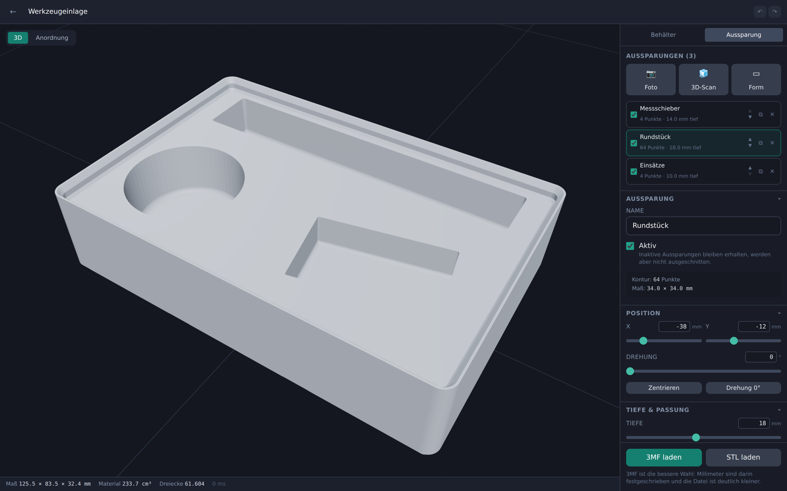
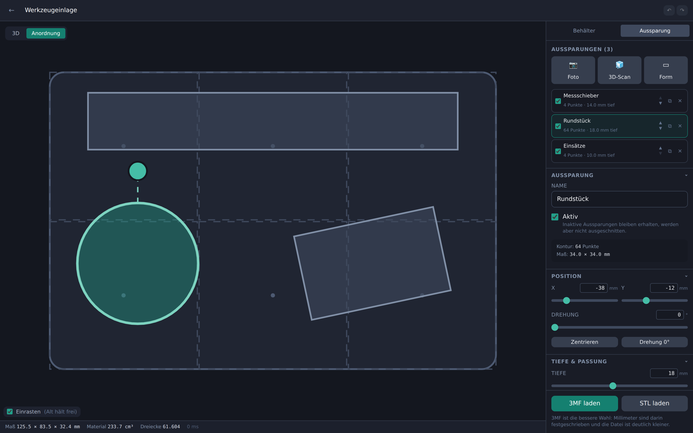
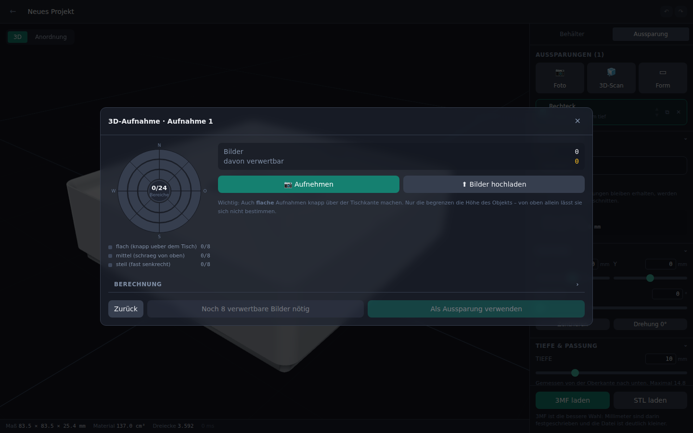

# Gridfinity Cutout Generator

Aus einem Foto wird ein druckfertiger Gridfinity-Einsatz mit passgenauer
Aussparung. Objekt auf ein DIN-A4-Blatt legen, abfotografieren, freistellen –
die App rechnet die Kontur in Millimeter um und schneidet sie als Tasche in
einen Gridfinity-Block. Optional lässt sich ein Objekt per Fotoserie in 3D
erfassen, sodass die Tasche der echten Form folgt statt nur dem Umriss.



## Was die Anwendung kann

- **Maß aus dem Foto.** Das Blatt im Bild dient als Referenz. Die vier Ecken
  werden automatisch erkannt und lassen sich nachziehen; daraus entsteht eine
  entzerrte Ansicht mit bekanntem Maßstab.
- **Objekt freistellen.** Rahmen ziehen, bei Bedarf mit zwei Pinseln
  korrigieren. Innenlöcher werden mit übernommen.
- **Mehrere Aussparungen je Bin**, frei verschiebbar und drehbar, mit
  Einrasten auf das 42-mm-Raster.
- **Viele Parameter:** Rastergröße, Höhe, Wand- und Bodenstärke, Stapelrand,
  Magnet- und Schraublöcher, Beschriftungssteg – und je Aussparung Tiefe,
  Spiel, Eckenradius, Entformschräge, Bodenradius, Durchbruch, Griffmulde und
  Fingerausschnitt.
- **Live-3D-Ansicht**, die Änderungen in etwa 100 ms nachzieht.
- **Autospeicherung** bei jeder Änderung, mit Rückgängig und Wiederholen.
- **Export als 3MF und STL**, wasserdicht und slicer-tauglich.
- **Optional: 3D-Aufnahme.** Objekt kopfüber auf ein gedrucktes Markerboard
  stellen, rundherum fotografieren – der Server rekonstruiert die Hüllform auf
  der CPU und stellt sie als Tasche bereit.

## Technik

| Bereich | Wahl | Begründung |
|---|---|---|
| Backend | Python 3.11, FastAPI, SQLite | Bildverarbeitung und Geometrie liegen in Python; SQLite spart einen weiteren Dienst |
| Geometrie | `manifold3d` + `trimesh` | robuste, schnelle CSG als reines pip-Wheel – kein OpenCASCADE nötig |
| Bildverarbeitung | OpenCV (headless) | Blatterkennung, Homographie, GrabCut |
| 3D-Rekonstruktion | OpenCV ChArUco + eigenes Space Carving | läuft auf der CPU, ohne externe Binaries |
| Frontend | React, TypeScript, Vite, Tailwind | |
| 3D-Ansicht | three.js über react-three-fiber | |
| Hintergrundarbeit | Jobtabelle in SQLite + eigener Worker-Prozess | Rekonstruktionen dauern Minuten und gehören aus dem Request-Pfad heraus |

Dass die Geometrie **serverseitig** gerechnet wird und nicht im Browser, ist
Absicht: es gibt nur eine Quelle der Wahrheit für Vorschau und Export. Damit
sich das trotzdem flüssig anfühlt, wird der Bin-Rohkörper je Parametersatz
zwischengespeichert – beim Verschieben einer Tasche läuft nur noch der
Boolean. Zusätzlich trägt jede Vorschau ein ETag, sodass ein zurückgedrehter
Regler nichts kostet. Während des Ziehens zeigt der Client sofort einen
Umriss und holt das echte Netz verzögert nach.

---

## Installation

Zwei Wege, beide auf Debian 12/13 getestet. **Podman Compose** ist der
einfachere; die **native Installation** kommt ohne Container-Laufzeit aus und
passt gut in einen schlanken LXC.

### Voraussetzungen

- Debian 12 oder 13 (LXC-Container, VM oder Blech)
- 2 GB RAM für den normalen Betrieb, 4 GB empfohlen, wenn 3D-Aufnahmen
  gerechnet werden
- rund 2 GB Plattenplatz zuzüglich der eigenen Projektdaten
- Für 3D-Aufnahmen: je mehr Kerne, desto besser. Auf einem i5-13500 dauert
  eine Rekonstruktion aus 30 Bildern etwa zwei bis fünf Minuten.

Ein unprivilegierter LXC genügt; besondere Rechte braucht die Anwendung nicht.

### Weg A – Podman Compose (empfohlen)

```bash
apt update && apt install -y podman podman-compose git
git clone https://github.com/danieldidla/Gridfinity-Advancet-Cutout-Generator.git
cd Gridfinity-Advancet-Cutout-Generator

cp .env.example .env
# Schlüssel erzeugen und in die .env eintragen:
python3 -c "import secrets; print('GCG_SECRET_KEY=' + secrets.token_urlsafe(48))" >> .env

podman-compose up -d --build
```

Der erste Build dauert einige Minuten, weil das Frontend übersetzt wird.
Danach läuft die Anwendung auf **http://\<IP-des-Containers\>:8000**.

Mit Docker statt Podman funktioniert dieselbe Datei:

```bash
docker compose up -d --build
```

Als systemd-Dienst starten lassen:

```bash
podman generate systemd --new --files --name gridfinity-cutout-app
podman generate systemd --new --files --name gridfinity-cutout-worker
cp container-gridfinity-cutout-*.service /etc/systemd/system/
systemctl daemon-reload
systemctl enable --now container-gridfinity-cutout-app container-gridfinity-cutout-worker
```

Nützliche Befehle:

```bash
podman-compose logs -f app       # Protokoll der API
podman-compose logs -f worker    # Protokoll der Rekonstruktion
podman-compose down              # anhalten (Daten bleiben im Volume)
podman-compose up -d --build     # aktualisieren
```

### Weg B – Native Installation im LXC

```bash
apt update && apt install -y git
git clone https://github.com/danieldidla/Gridfinity-Advancet-Cutout-Generator.git
cd Gridfinity-Advancet-Cutout-Generator
sudo bash deploy/install.sh
```

Das Skript installiert die Systempakete, legt das Dienstkonto `gridfinity` an,
richtet unter `/opt/gridfinity-cutout` eine virtuelle Python-Umgebung ein, baut
das Frontend, schreibt zwei systemd-Units und stellt nginx davor. Am Ende
steht die Adresse im Terminal. Die Anwendung ist dann über **Port 80**
erreichbar.

Das Skript lässt sich gefahrlos erneut ausführen, um zu aktualisieren:

```bash
cd Gridfinity-Advancet-Cutout-Generator && git pull && sudo bash deploy/install.sh
```

Anpassen lässt sich das über Umgebungsvariablen:

```bash
sudo PORT=8080 HTTP_PORT=8080 SERVER_NAME=gridfinity.lan \
     INSTALL_NGINX=no bash deploy/install.sh
```

Betrieb:

```bash
systemctl status gridfinity-cutout gridfinity-cutout-worker
journalctl -u gridfinity-cutout -f
nano /etc/gridfinity-cutout.env          # danach neu starten
systemctl restart gridfinity-cutout gridfinity-cutout-worker
```

Entfernen: `sudo bash deploy/uninstall.sh` (mit `--purge` samt Projektdaten).

### Nach der Installation

1. Seite aufrufen und ein Konto anlegen. **Das erste Konto wird automatisch
   Administrator.**
2. Danach in der Konfiguration `GCG_ALLOW_REGISTRATION=false` setzen und die
   Dienste neu starten, wenn sich sonst niemand registrieren können soll.
   Weitere Konten legt der Administrator dann unter *Verwaltung* an.

### HTTPS und die Kamera im Browser

Die Aufnahme direkt aus dem Browser (`getUserMedia`) geben Browser nur über
**HTTPS** oder auf `localhost` frei. Ohne TLS funktioniert alles andere
weiterhin – Fotos lassen sich hochladen, was vom Handy aus ohnehin oft
bequemer ist. Für TLS am einfachsten einen Reverse Proxy davorsetzen, oder bei
öffentlichem Namen:

```bash
apt install -y certbot python3-certbot-nginx
certbot --nginx -d gridfinity.example.org
```

### Datensicherung

Alles Veränderliche liegt in einem Verzeichnis: Datenbank, Fotos, Netze.

```bash
# native Installation
systemctl stop gridfinity-cutout gridfinity-cutout-worker
tar czf gridfinity-backup-$(date +%F).tar.gz -C /var/lib gridfinity-cutout
systemctl start gridfinity-cutout gridfinity-cutout-worker

# Compose
podman volume export gridfinity-data > gridfinity-backup-$(date +%F).tar
```

---

## Bedienung

| Anordnung | 3D-Aufnahme |
|---|---|
|  |  |

### Aussparung aus einem Foto

1. Objekt auf ein leeres Blatt legen, sodass das **ganze Blatt** im Bild ist.
   Möglichst senkrecht von oben, gleichmäßiges Licht, keine harten Schatten.
2. *Foto* → aufnehmen oder hochladen.
3. Die vier Ecken prüfen und nachziehen, Blattformat wählen, entzerren.
4. Rahmen um das Objekt ziehen, *Kontur berechnen*. Sitzt etwas nicht, mit
   „Behalten“ und „Entfernen“ nachbessern.
5. Übernehmen, danach rechts Tiefe, Spiel und Form einstellen.

Zur Genauigkeit: In der Testreihe wird ein 60 × 40 mm großes Objekt aus einem
schräg aufgenommenen Foto auf etwa **0,3 mm genau** vermessen. Der größte
Hebel ist, wie exakt die Blattecken sitzen.

### Die richtige Passung

Beim Spiel kommt es auf den Zweck an. 0,3–0,6 mm passt für die meisten
Drucker und lässt das Teil bequem herausnehmen. Soll es klemmen, weniger;
für Teile mit Toleranz eher mehr. Eine Entformschräge von 2–3° hilft
zusätzlich beim Entnehmen, ebenso die Griffmulde.

### 3D-Aufnahme

1. *3D-Scan* → **Board als PDF drucken**, unbedingt in Originalgröße
   („100 %“, nicht „an Seite anpassen“). Kontrollmaß: ein Kästchen ist
   25 mm breit.
2. Board flach auf den Tisch, Objekt **mit der Unterseite nach oben** mittig
   darauf.
3. Rundherum fotografieren. Die Scheibe zeigt, welche Bereiche noch fehlen;
   nach jedem Bild kommt direkt eine Rückmeldung zu Schärfe und Erkennung.
   Mindestens 8 verwertbare Bilder, gut sind 24 bis 40.
4. *Berechnung starten*. Der Fortschritt bleibt sichtbar; die Seite darf dabei
   geschlossen werden.
5. *Als Aussparung verwenden*.

**Warum kopfüber?** So sieht die Kamera die Unterseite – genau die Fläche, die
später auf dem Taschenboden aufliegt. Die App dreht das Ergebnis beim Einsetzen
automatisch zurück.

**Warum auch flache Aufnahmen?** Die Höhe eines Objekts lässt sich nur durch
Blickwinkel begrenzen, die an ihm vorbeischauen. Nur von oben fotografiert
bleibt über dem Objekt Material stehen.

#### Was das Verfahren leistet und was nicht

Gerechnet wird eine **visuelle Hülle**: Ein Volumenpunkt bleibt bestehen, wenn
er in *jeder* Ansicht innerhalb der Silhouette liegt. Das hat drei Folgen, die
man kennen sollte:

- Das Ergebnis **umschließt** das Objekt immer, ist also nie zu klein. Für eine
  Tasche ist genau das die richtige Eigenschaft.
- **Grundfläche und Querschnitte** werden gut getroffen – in der Testreihe auf
  etwa 1 mm.
- **Vertiefungen, die in keiner Silhouette auftauchen**, werden nicht erfasst,
  und bei flachen Oberseiten fällt die **Höhe einige Millimeter zu groß** aus.
  Für eine Einlegetasche ist beides unkritisch: Die Tiefe wird ohnehin von Hand
  gesetzt, und die Option *Nach oben öffnen* weitet die Tasche nach oben auf,
  damit das Teil überhaupt hineinpasst.

Wer texturierte Oberflächen fotorealistisch erfassen will, ist mit
Photogrammetrie (COLMAP/OpenMVS) besser bedient. Für Passform-Taschen ist die
Hülle das robustere und deutlich schnellere Verfahren – und sie braucht keine
Textur, funktioniert also auch bei einfarbigen, glänzenden Teilen, an denen
klassische Photogrammetrie scheitert.

---

## Konfiguration

Alle Werte sind optional und werden als Umgebungsvariablen gesetzt – in
`/etc/gridfinity-cutout.env` (nativ) oder in `.env` (Compose).

| Variable | Vorgabe | Bedeutung |
|---|---|---|
| `GCG_DATA_DIR` | `/var/lib/gridfinity-cutout` | Datenbank, Fotos, Netze |
| `GCG_SECRET_KEY` | erzeugt | Signiert die Sitzungscookies |
| `GCG_ALLOW_REGISTRATION` | `true` | Offene Registrierung; das erste Konto geht immer |
| `GCG_APP_NAME` | Gridfinity Cutout Generator | Name in der Oberfläche |
| `GCG_MAX_UPLOAD_MB` | `40` | Größte Einzeldatei |
| `GCG_MAX_SCAN_IMAGES` | `200` | Bilder je 3D-Aufnahme |
| `GCG_TOKEN_TTL_HOURS` | `336` | Gültigkeit der Anmeldung |
| `GCG_SCAN_VOXEL_MM` | `0.5` | Auflösung der Rekonstruktion |
| `GCG_CORS_ORIGINS` | leer | Nur für die Entwicklung nötig |

---

## Entwicklung

```bash
python3 -m venv .venv && .venv/bin/pip install -r backend/requirements.txt
cd frontend && npm install && cd ..

# Terminal 1 – API
GCG_DATA_DIR=./data GCG_CORS_ORIGINS=http://localhost:5173 \
  PYTHONPATH=backend .venv/bin/python -m uvicorn app.main:app --reload

# Terminal 2 – Worker
GCG_DATA_DIR=./data PYTHONPATH=backend .venv/bin/python -m app.worker

# Terminal 3 – Frontend mit Hot Reload auf http://localhost:5173
cd frontend && npm run dev
```

Tests:

```bash
.venv/bin/python -m pytest backend/tests -q     # 67 Tests
cd frontend && npx tsc --noEmit
```

Die Tests prüfen die Maße gegen die Gridfinity-Spezifikation, die
Wasserdichtigkeit der Exporte, die Millimetergenauigkeit aus dem Foto und –
gegen synthetisch gerenderte Aufnahmen eines Körpers bekannter Größe – die
komplette 3D-Kette einschließlich Worker.

### Aufbau

```
backend/app/
  gridfinity/    Maße, 2D-Profile, Bin- und Taschenkörper, Export
  scan/          Markerboard, Kalibrierung, Silhouetten, Space Carving
  services/      Bildverarbeitung, Ablage, Jobqueue, Vorschau-Cache
  routers/       HTTP-Schnittstelle
  worker.py      Hintergrundprozess
frontend/src/
  three/         3D-Ansicht
  components/    Assistenten, Einstellungen, Anordnung
  lib/           API-Client, Zustand mit Autospeicherung
deploy/          install.sh, nginx.conf, uninstall.sh
```

---

## Wenn etwas klemmt

**Das Blatt wird nicht erkannt.** Dunkler Untergrund hilft, ebenso das ganze
Blatt im Bild. Notfalls die Ecken von Hand setzen – das Ergebnis ist genauso
genau.

**Die Aussparung schneidet nichts weg.** Vermutlich ist *Massiver Block*
ausgeschaltet; dann liegt die Tasche im ohnehin leeren Innenraum. Die App
weist unten darauf hin.

**Das Board wird nicht erkannt.** Meist Bewegungsunschärfe oder Spiegelungen
auf glänzendem Papier. Mattes Papier, mehr Licht, ruhig halten.

**Die Rekonstruktion schlägt fehl.** Mit weniger, dafür besseren Bildern
beginnen; auf gleichmäßigen Untergrund achten. Der Schwellwert unter
*Berechnung* steuert, wie viel als Objekt gilt.

**Der Worker arbeitet nicht.** Läuft er?
`systemctl status gridfinity-cutout-worker` bzw. `podman-compose logs worker`.
Ohne Worker bleiben Aufnahmen auf „wird berechnet“ stehen.

**Der Container startet nicht.** Meist zu wenig Speicher beim Frontend-Build.
Mit 2 GB RAM im LXC klappt es; ansonsten das Frontend außerhalb bauen.

---

## Lizenz

Siehe [LICENSE](LICENSE).

Gridfinity stammt von Zack Freedman. Dieses Projekt setzt die Maße der
offenen Spezifikation um und steht in keiner Verbindung zu ihm.
